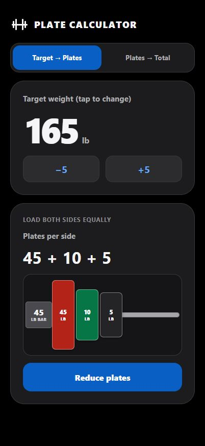
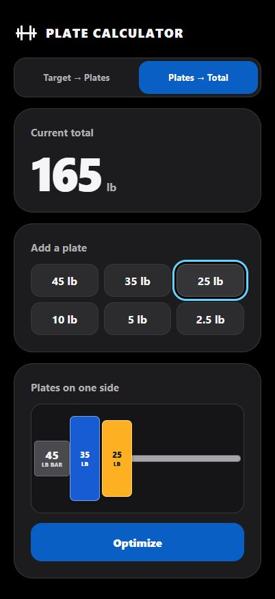

# Barbell Plate Calculator

A fast, mobile-first barbell loading calculator built for use between sets. It answers two questions without requiring an account, a backend, or a network connection after the first load:

- **Target → Plates:** enter a target weight and see which plates to load on each side.
- **Plates → Total:** select the plates on one side and see the total loaded weight.

The calculator uses a fixed 45 lb bar, assumes both sides are loaded equally, and supports 45, 35, 25, 10, 5, and 2.5 lb plates.

## Why

This application was my first attempt at coding using a spec-driven development approach. It's a real use-case I intend to use for myself, so don't expect much development beyond this initial release. Consider this project a toy.

## Screenshots

| Target → Plates | Plates → Total |
| --- | --- |
|  |  |

## Features

- Immediate calculations with no separate submit button
- `−5` and `+5` target controls plus direct decimal entry
- Deterministic rounding to the nearest achievable total, with midpoint ties rounded down
- Greedy, heaviest-first default plate loading
- Optional **Reduce plates** action when the same target can be reached with fewer plates
- One-tap plate entry and removal in Plates → Total mode
- Optional **Optimize** action that converts a manually selected load to the canonical heaviest-first configuration
- Color-coded, proportionally sized plate visualization with readable weight labels
- Responsive, touch-friendly interface designed first for portrait phones
- Installable Progressive Web App with offline calculator support
- Static GitHub Pages deployment

## How calculations work

Every total includes the fixed 45 lb bar. Plates shown or selected represent one side only; the same load is assumed on the other side.

For a resolved target `T`, the required weight per side is:

```text
(T - 45) / 2
```

Achievable totals are 45 lb and every 5 lb increment above it. Targets below 45 lb resolve to 45 lb. The default plate configuration fills the required side weight from heaviest to lightest using `[45, 35, 25, 10, 5, 2.5]`.

## Technology

- React 19 and TypeScript
- Vite
- Vitest and Testing Library
- `vite-plugin-pwa` and Workbox
- Plain CSS
- GitHub Actions and GitHub Pages

All calculation rules live in framework-independent domain modules. React components consume those functions rather than duplicating the rules in the UI.

## Local development

Requirements:

- Node.js 24
- pnpm 11.19.0

Install dependencies and start the development server:

```bash
pnpm install
pnpm dev
```

## Verification

```bash
pnpm run typecheck
pnpm test
pnpm run build
pnpm run verify:pwa
```

`verify:pwa` runs after the production build and validates the generated manifest, icons, service worker, and precached application shell.

## PWA and deployment

The production build uses `/plate-calculator/` as its GitHub Pages project base path. After one successful online visit, the generated service worker caches the application so both calculator modes continue to work offline.

Pushes to `main` run the GitHub Pages workflow in [`.github/workflows/deploy-pages.yml`](.github/workflows/deploy-pages.yml). The repository must have **Settings → Pages → Build and deployment → Source** set to **GitHub Actions**.

## Specifications

This project is developed in vertical slices from explicit product and engineering specifications:

- [Product specification](specs/product.md)
- [Requirements](specs/requirements.md)
- [Architecture](specs/architecture.md)
- [Architecture decision records](specs/adr)
- [Slice specifications](specs/slices)
- [Implementation plans](specs/plans)
